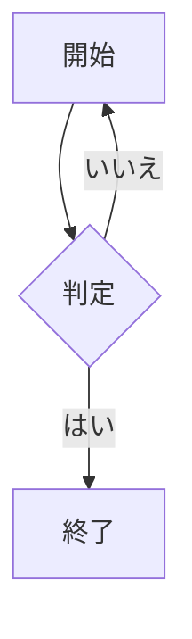

# 日本語の Markdown

これは **太字** と *斜体*、`コード`、[リンク](https://example.com) を含む文章である。

- 第一項
- 第二項

> 引用も表示する。

| 名前 | 値 |
| --- | ---: |
| 日本語 | 42 |

```text
const answer = 42;
```

インライン数式 $x^2 + y^2 = z^2$ を含む。

$$
\frac{a^2 + b^2}{c^2} = 1
\sum_{i=1}^{n} i
$$




